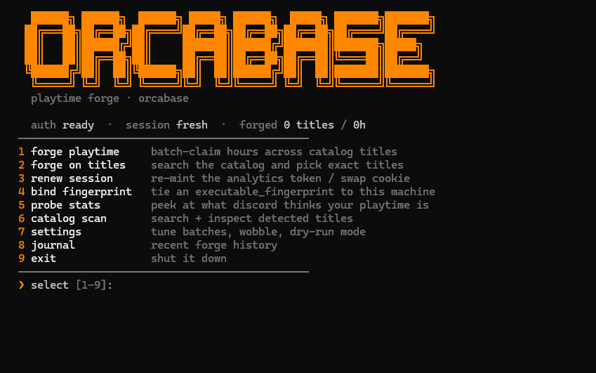

<h1 align="center">Discord badge spoofer</h1>

<p align="center"><b>spoof your discord playtime &amp; badges</b> — a cli tool that inflates your playtime and games-played badges by replaying the same telemetry events the real client sends. no rich presence tricks, no overlay — this posts launch + heartbeat events straight to the same endpoint the official client uses, so discord itself credits the hours.</p>

<div align="center">



</div>

---

## Features

- **Inflate playtime &amp; games-played badges** — logs hours across catalog titles; hours badge tiers up with total playtime, games-played badge unlocks at 5+ titles.
- **Bulk forging** — batch-claim hours across the entire catalog in one run, with automatic rotation so recently-forged titles are deprioritized.
- **Targeted forging** — search the game catalog and forge on exactly the titles you want.
- **Full catalog access** — indexes thousands of detectable titles straight from discord's own catalog.
- **Fingerprint binding** — tie an `executable_fingerprint` to your machine (windows-only) so badges credit properly.
- **Session management** — auto-mints and renews analytics tokens, handles `cf_clearance` cookie rotation.
- **Probe mode** — peek at what discord actually thinks your account looks like.
- **Tunable settings** — batch size, batch pause, ±3% hour wobble for realism, dry-run mode to test without sending anything, and default hours.
- **Forge journal** — every run is logged (live vs. dry, ok/failed counts, total hours) so you can track your history.
- **Credential vault** — token and cookie are stored locally in an encrypted-style vault file, mirrored into a dynamic `.env`.

---

## Installation

```bash
git clone <githublink>
```

```bash
npm i
```

```bash
node index.js
```

### or automatic everything

```bash
setup.bat
```

---

## Preview

<div align="center">


</div>

---

## Requirements

| Requirement | Notes |
|---|---|
| **Node.js 18+** | required for native `fetch` |
| **Discord account token** | pasted on first run, stored locally |
| **`cf_clearance` cookie** | from `discord.com` → devtools → application → cookies |

---

## Getting your credentials

### Discord token

1. Open `discord.com` in your browser and log in.
2. Press `Ctrl+Shift+I` to open devtools.
3. Go to the **Network** tab, filter by `/api`, and refresh.
4. Click any request → **Headers** → copy the `Authorization` value.

### cf_clearance cookie

1. In the same devtools window, go to **Application** → **Cookies** → `https://discord.com`.
2. Copy the value of `cf_clearance`.

> [!NOTE]
> The `cf_clearance` cookie expires periodically. When it does, use menu option **3** in the tool to paste a fresh one and re-mint your session.

---

## Usage

Once running, you get an interactive menu:

| # | Option | What it does |
|---|---|---|
| 1 | **forge playtime** | batch-claim hours across catalog titles |
| 2 | **forge on titles** | search the catalog and pick exact titles |
| 3 | **renew session** | re-mint the analytics token / swap cookie |
| 4 | **bind fingerprint** | tie an `executable_fingerprint` to this machine |
| 5 | **probe stats** | peek at what discord thinks your playtime is |
| 6 | **catalog scan** | search + inspect detected titles |
| 7 | **settings** | tune batches, wobble, dry-run mode |
| 8 | **journal** | recent forge history |
| 9 | **exit** | shut it down |

### Example forge run

```
  forging 2.5h on 12 titles · ~30h total
  ─────────────────────────────────────────
  [ok]  1/12  Aperture Desk Job
  [ok]  2/12  Baldur's Gate 3
  ...
  done · 12/12 titles · 30h logged
```

---

## Settings

Tweak these via menu option **7**:

| Setting | Default | Description |
|---|---|---|
| `batch size` | `50` | titles per `/science` request |
| `batch pause` | `300 ms` | breathing room between requests |
| `wobble` | `on` | ±3% drift on logged hours for realism |
| `dry run` | `off` | build events but send nothing |
| `default hours` | `1` | fallback answer for the hours prompt |

---

## How it works

The tool posts `launch_game` + `running_game_heartbeat` event triplets to `/api/v9/science` — the same endpoint the real client uses to credit playtime. `duration_tracked_ms` isn't validated server-side, so any number goes through.


---

## Project structure

```
spoofbadge/
├── index.js          # entry point
├── setup.bat         # one-click install + launch
├── src/
│   ├── auth.js       # token parsing, headers, fingerprints
│   ├── banner.js     # ascii art + quips
│   ├── config.js     # endpoints, paths, limits, client identity
│   ├── envstore.js   # dynamic .env mirror
│   ├── features.js   # cli feature flows
│   ├── forge.js      # batch runner
│   ├── format.js     # number/time formatting
│   ├── games.js      # catalog loading + search
│   ├── log.js        # terminal colors + logging
│   ├── props.js      # super properties
│   ├── science.js    # event construction
│   ├── session.js    # analytics token minting
│   ├── ui.js         # menus + prompts
│   └── vault.js      # encrypted state store
├── assets/
│   ├── image.png     # tool screenshot
│   └── image2.png    # badge in discord
└── package.json
```

---

## FAQ

**Is this safe?** No. This violates discord's terms of service. Your account, your problem.

**Will I get banned?** Possibly. Rate limits, weird telemetry patterns, or a fingerprint mismatch can all flag you. Use dry-run mode first, keep wobble on, and don't forge insane hour counts.

**When do badges show up?** Playtime badge tiers update with total tracked hours; the games-played badge needs 5+ distinct titles. Give discord some time to process the events.

**Where's my data stored?** Everything (token, cookie, fingerprint, journal) lives locally in `vault.json` and `journal.jsonl`. Nothing is sent anywhere except to discord itself.

**Windows only?** The tool runs anywhere node runs, but fingerprint binding (menu 4) is windows-only.

---

## Disclaimer

> [!WARNING]
> **This tool violates discord's terms of service.** You are forging telemetry data. Account termination is a real possibility — use at your own risk. This project is for educational purposes only.

---

<div align="center">

**orcabase** · 2026 · MIT licensed

</div>
